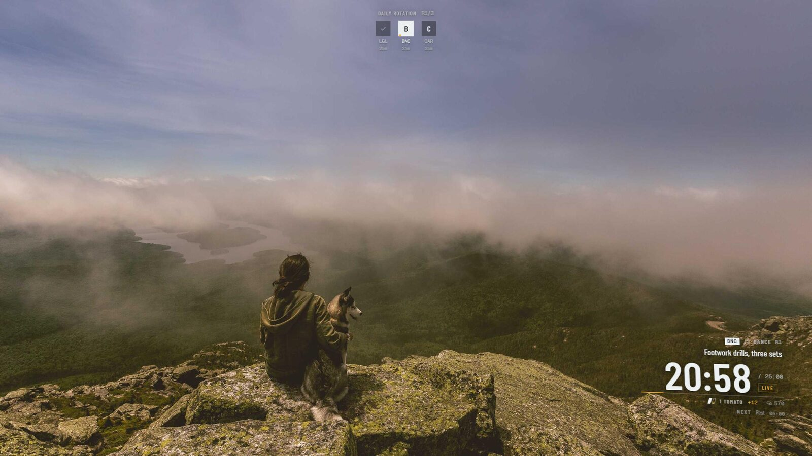
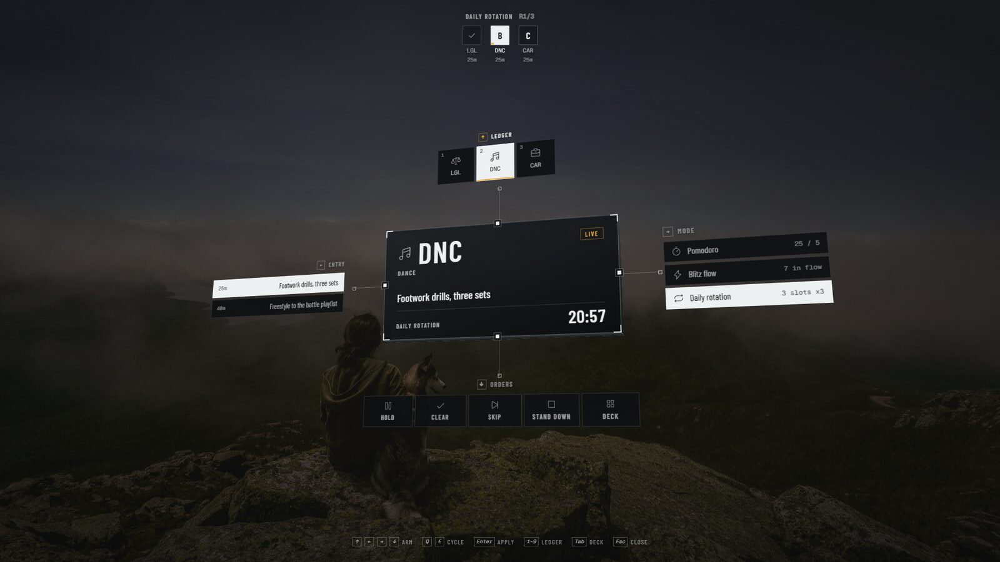
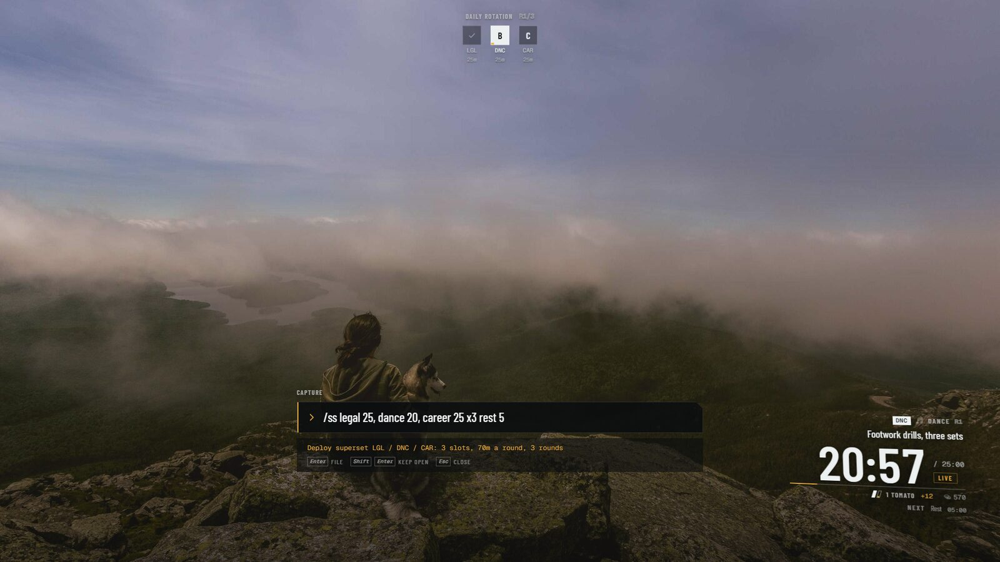
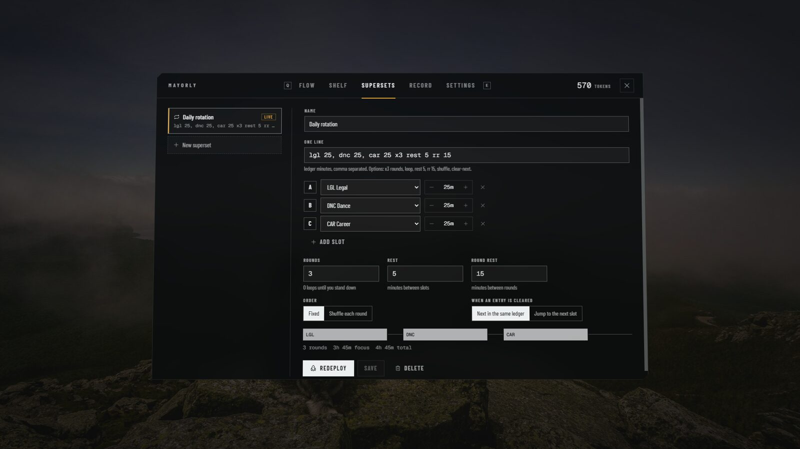

# Mayorly app

The application layer of **Mayorly**, Windows first. A transparent focus HUD that sits on top of whatever you are doing, runs your day as one continuous flow, and rotates between the things you care about on rules you write.

It is the architecture north star for the whole project: the entries, ledgers, desk, tomatoes and tokens from [mayorly-design](https://github.com/shane1595042264/mayorly-design) live here as a pure domain core, and the HUD is the first client of it. The pixel-art Mayor's Hall from [mayorly-assets](https://github.com/shane1595042264/mayorly-assets) becomes a second client later, on the same core.



## What it does

- **Lock in on one thing.** Pick an entry or a ledger and deploy. The HUD in the corner shows only that: the ledger callsign, the entry, a big countdown, tomatoes banked this sitting.
- **Continuous flow, like Blitz.** Blitz mode runs your flow top to bottom. Clear an entry and the next one is already running, timed against its own estimate. No list to go back to.
- **Pomodoro, like Focus To-Do.** Focus and rest cycles with a long rest every fourth, on any entry or on a ledger alone ("Dance time, no entry").
- **Supersets: your own rotation rules.** Legal 25, Dance 20, Career 25, three rounds, five minutes of rest between, fifteen between rounds. The desk switches on its own. Order can be fixed or shuffled per round, and you choose what happens when you clear an entry mid-block.
- **Swap in real time.** Hold or tap **Alt+T** for the Plus menu: the loadout floats in 3D with four attachment arms around it. Ledger up, entry left, mode right, orders down. Press **1-9** to jump ledgers, or click. The block timer keeps running through a swap; only the work changes.
- **Tracks time.** Every second of desk time is a segment against an entry and a ledger. The Record tab shows today by ledger, the last seven days, and the clerk's log.
- **Tokens, by the spec.** 12 per tomato, 18 each once a sitting reaches three. Earned only at the desk. Nothing decays, no streaks, an explicit hold.



## Hotkeys

Global, from any app. All of them can be changed in Deck, Settings.

| | |
|---|---|
| **Alt+T** | Plus menu. Tap to toggle, or hold to peek and release to close. |
| **Alt+N** | Capture. Type, Enter, it lands in the flow. |
| **Alt+M** | Deck: flow, shelf, supersets, record, settings. **Q / E** switch tabs. |
| **Alt+P** | Hold and resume the desk. |
| **Alt+H** | Hide or show the HUD. |

Inside the Plus menu: arrow keys or WASD pick an arm, **Q / E** cycle, **Enter** applies, **1-9** jump to a ledger, **Tab** opens the deck, **Esc** closes.

In field mode the overlay is click-through. Only the HUD's own controls catch the pointer, and it never takes keyboard focus, so it cannot steal a keystroke from what you are working in.

## Capture and the command line

Plain text is an entry. The mute clerk files it:

```
legal: reply to the landlord ~20      files to LGL, 20 minute estimate
footwork drills #dnc ~1h              files to DNC by tag, 60 minutes
book a haircut                        lands in the tray, no ledger named
```

A leading slash is an order:

```
/ss legal 25, dance 20, career 25 x3 rest 5 rr 15     write a superset and deploy it
/pomo dance        /blitz        /hold        /go        /skip        /stand
```

Superset options: `x3` rounds, `loop` until you stand down, `rest 5`, `rr 15` between rounds, `shuffle`, `clear-next` to jump to the next slot when an entry is cleared.



## Install

Download `Mayorly-Setup-<version>.exe` or the portable exe from [Releases](https://github.com/shane1595042264/mayorly-app/releases). The build is unsigned, so Windows SmartScreen will warn on first run: More info, Run anyway.

Mayorly lives in the tray. Right-click it for the display picker (it runs on one monitor at a time), open at login, and the data folder.

Your data is one JSON file at `%APPDATA%\Mayorly\mayorly.json`, written atomically. Nothing leaves the machine.

## Build from source

```bash
npm install
```

```bash
npm run dev
```

| | |
|---|---|
| `npm run dev` | the Electron app with hot reload |
| `npm run web` | the HUD alone in a browser at `localhost:5199`, running the same engine in the page. Add `?demo` for sample data, `?fresh` for a first run |
| `npm test` | domain core tests |
| `npm run typecheck` | TypeScript over everything |
| `npm run dist` | Windows installer and portable exe into `dist/` |
| `npm run icon` | rebuild the icons from the founder's hand-drawn tomato |

## How it is put together

```
src/core      the domain: entries, ledgers, desk, planner, tokens, clerk. Pure, tested, no Electron, no DOM.
src/main      the shell: owns the one true state, heartbeat, persistence, overlay window, hotkeys, tray.
src/preload   the bridge, nothing else.
src/renderer  the HUD: field HUD, Plus menu, deck, capture. A client of the bridge.
src/shared    the Bridge contract every client speaks.
```

The full picture, including how the pixel game and the mod API plug in, is in [docs/architecture.md](docs/architecture.md). Every non-obvious choice is in [docs/decisions.md](docs/decisions.md).



## Credits

- App icon: the founder's hand-drawn `icon.tomato` from mayorly-assets, scaled by whole pixels.
- Type: Barlow Condensed and Geist Mono, both under the SIL Open Font License, bundled through Fontsource.
- Icons: Phosphor.
- The HUD language is inspired by Battlefield 2042's HUD and Plus system. No game assets are used.
